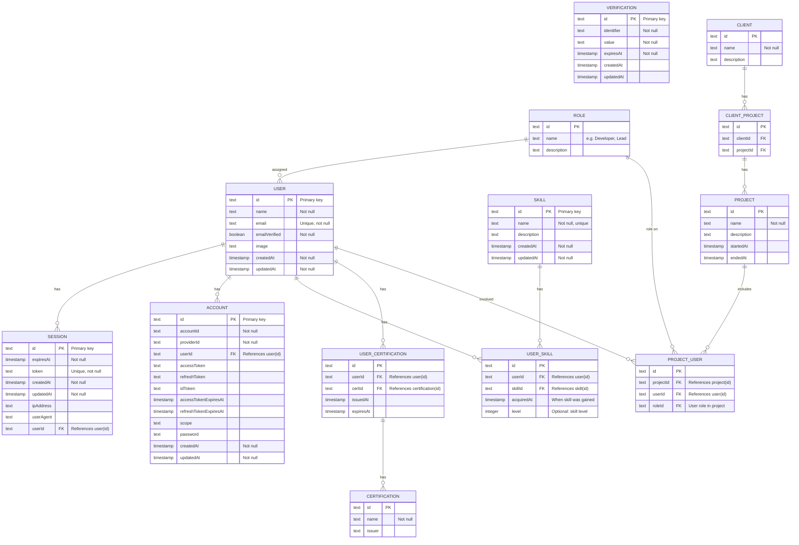

```mermaid
erDiagram
    USER {
        text id PK "Primary key"
        text name "Not null"
        text email "Unique, not null"
        boolean emailVerified "Not null"
        text image
        timestamp createdAt "Not null"
        timestamp updatedAt "Not null"
    }

    SESSION {
        text id PK "Primary key"
        timestamp expiresAt "Not null"
        text token "Unique, not null"
        timestamp createdAt "Not null"
        timestamp updatedAt "Not null"
        text ipAddress
        text userAgent
        text userId FK "References user(id)"
    }

    ACCOUNT {
        text id PK "Primary key"
        text accountId "Not null"
        text providerId "Not null"
        text userId FK "References user(id)"
        text accessToken
        text refreshToken
        text idToken
        timestamp accessTokenExpiresAt
        timestamp refreshTokenExpiresAt
        text scope
        text password
        timestamp createdAt "Not null"
        timestamp updatedAt "Not null"
    }

    VERIFICATION {
        text id PK "Primary key"
        text identifier "Not null"
        text value "Not null"
        timestamp expiresAt "Not null"
        timestamp createdAt
        timestamp updatedAt
    }

    SKILL {
        text id PK "Primary key"
        text name "Not null, unique"
        text description
        timestamp createdAt "Not null"
        timestamp updatedAt "Not null"
    }

    USER_SKILL {
        text id PK
        text userId FK "References user(id)"
        text skillId FK "References skill(id)"
        timestamp acquiredAt "When skill was gained"
        integer level "Optional: skill level"
    }

    CERTIFICATION {
        text id PK
        text name "Not null"
        text issuer
    }

	USER_CERTIFICATION {
		text id PK
		text userId FK "References user(id)"
		text certId FK "References certification(id)"
		timestamp issuedAt
        timestamp expiresAt
	}

    ROLE {
        text id PK
        text name "e.g. Developer, Lead"
        text description
    }

	CLIENT {
        text id PK
        text name "Not null"
        text description
    }

	CLIENT_PROJECT {
        text id PK
        text clientId FK
        text projectId FK
	}

    PROJECT {
        text id PK
        text name "Not null"
        text description
        timestamp startedAt
        timestamp endedAt
    }

    PROJECT_USER {
        text id PK
        text projectId FK "References project(id)"
        text userId FK "References user(id)"
        text roleId FK "User role in project"
    }

	USER ||--o{ SESSION : "has"
    USER ||--o{ ACCOUNT : "has"
    USER ||--o{ USER_SKILL : "has"
    SKILL ||--o{ USER_SKILL : "has"
    USER ||--o{ USER_CERTIFICATION : "has"
    USER_CERTIFICATION ||--o{ CERTIFICATION : "has"
    ROLE ||--o{ USER : "assigned"
    PROJECT ||--o{ PROJECT_USER : "includes"
    USER ||--o{ PROJECT_USER : "involved"
    ROLE ||--o{ PROJECT_USER : "role on"
    
    CLIENT ||--o{ CLIENT_PROJECT : "has"
    CLIENT_PROJECT ||--o{ PROJECT : "has"
```

// TODO

chatbot logs (nosql)
project details (nosql)
