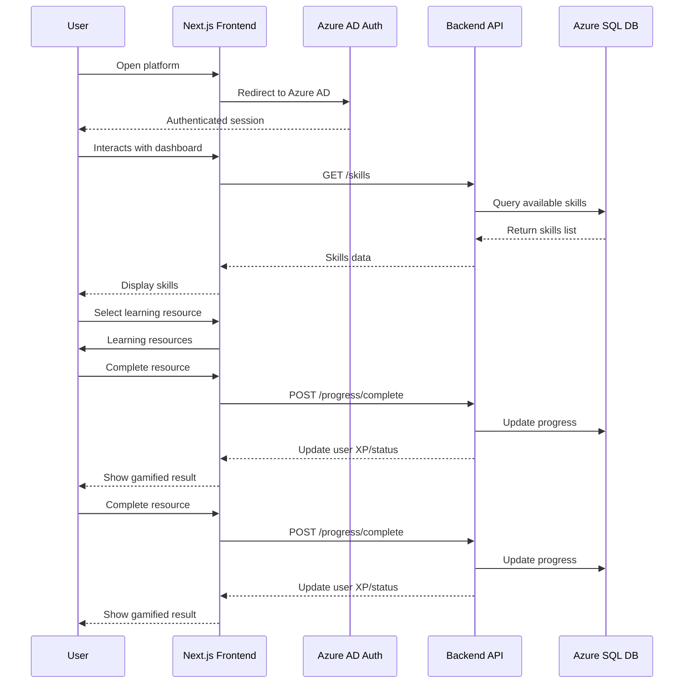

```mermaid
sequenceDiagram
    participant User
    participant Frontend as Next.js Frontend
    participant Auth as Azure AD Auth
    participant API as Backend API
    participant DB as Azure SQL DB

    User->>Frontend: Open platform
    Frontend->>Auth: Redirect to Azure AD
    Auth-->>User: Authenticated session
    User->>Frontend: Interacts with dashboard

    Frontend->>API: GET /skills
    API->>DB: Query available skills
    DB-->>API: Return skills list
    API-->>Frontend: Skills data
    Frontend-->>User: Display skills

    User->>Frontend: Select learning resource
    Frontend->>User: Learning resources

    User->>Frontend: Complete resource
    Frontend->>API: POST /progress/complete
    API->>DB: Update progress
    API-->>Frontend: Update user XP/status
    Frontend-->>User: Show gamified result

	User->>Frontend: Complete resource
    Frontend->>API: POST /progress/complete
    API->>DB: Update progress
    API-->>Frontend: Update user XP/status
    Frontend-->>User: Show gamified result

```
